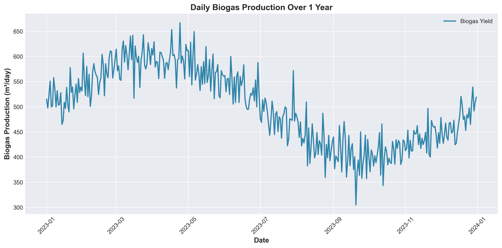
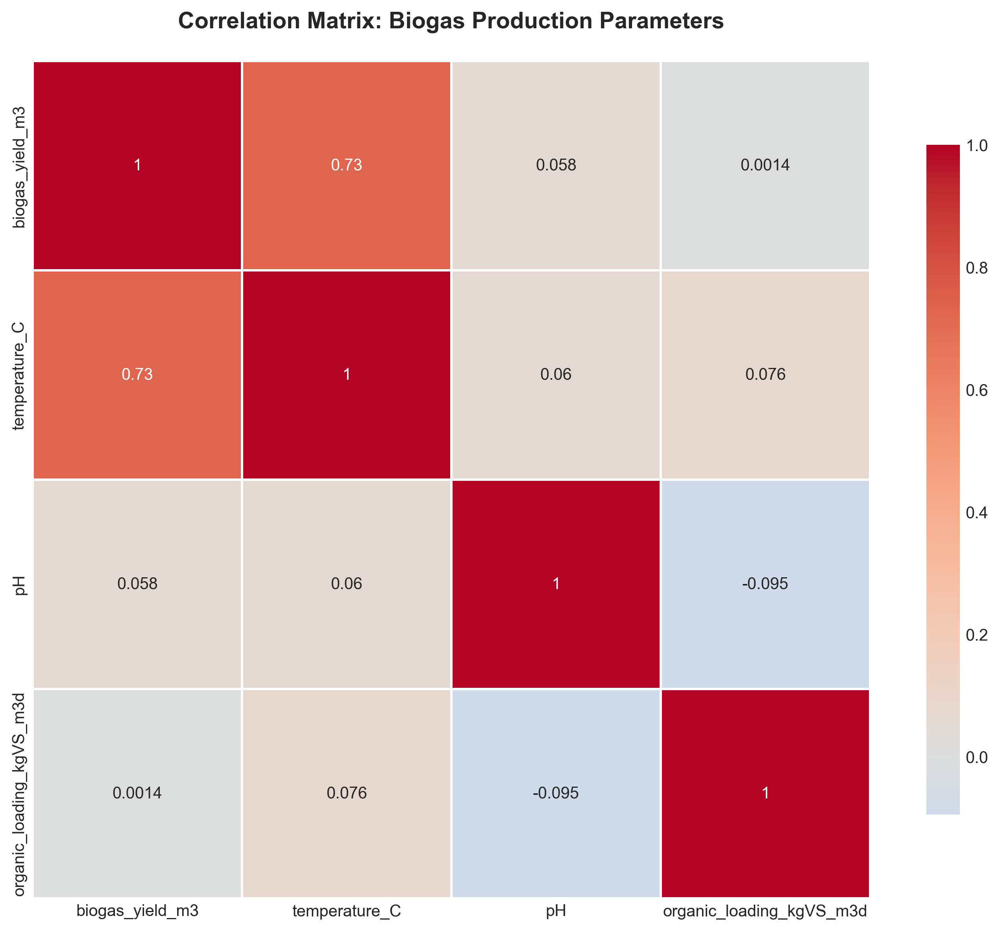
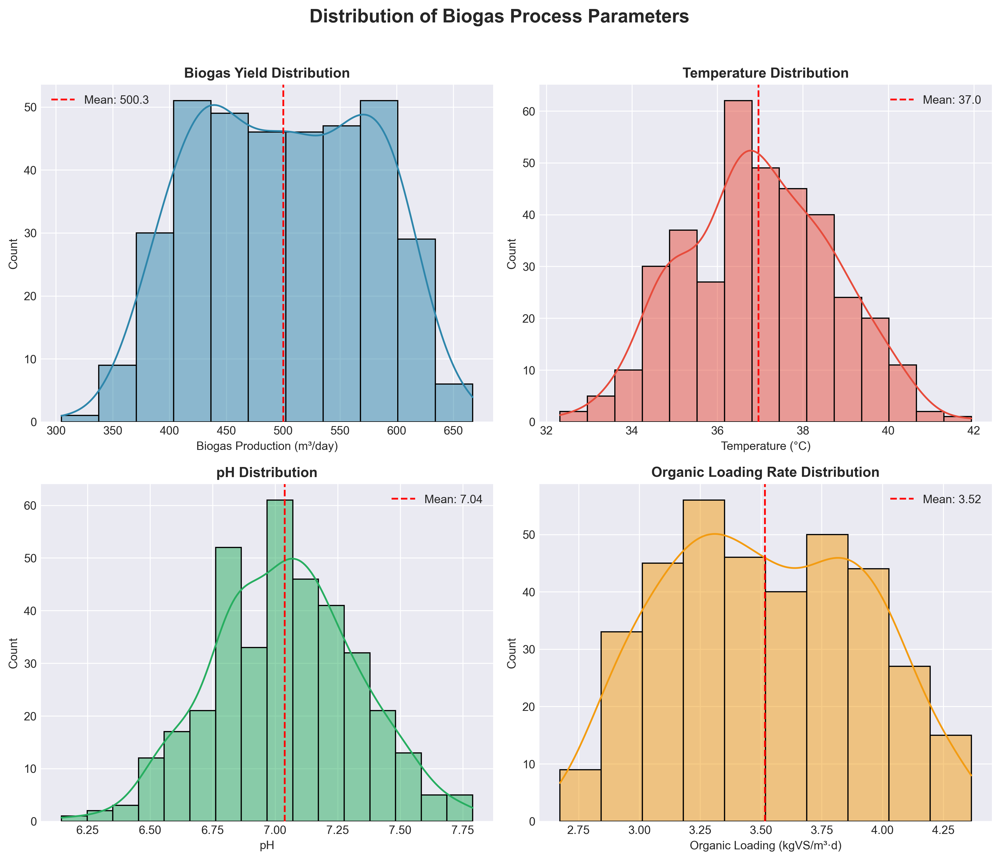

# 🌱 Biogas Production Forecasting

##  Objective
Predict daily biogas yield from anaerobic digestion using historical operational data. This project demonstrates time series forecasting and exploratory data analysis applied to bioenergy systems.

## Data
- **Source**: Synthetic data generated based on typical anaerobic digestion patterns
- **Variables**: Biogas yield (m³/day), Temperature (°C), pH, Organic loading rate
- **Period**: 365 days of daily observations

##  Methods
- Exploratory Data Analysis (EDA) with pandas, matplotlib, seaborn
- Time series visualization and correlation analysis
- Future: Machine learning models (Linear Regression, Random Forest, LSTM)

## Results

### Time Series Analysis


### Correlation Analysis  


### Distribution Analysis


##  How to Run

```bash
# Clone the repository
git clone https://github.com/hiteshrana1/biogas-forecasting.git
cd biogas-forecasting

# Install dependencies
pip install -r requirements.txt

# Run the notebook
jupyter notebook notebooks/01_eda.ipynb